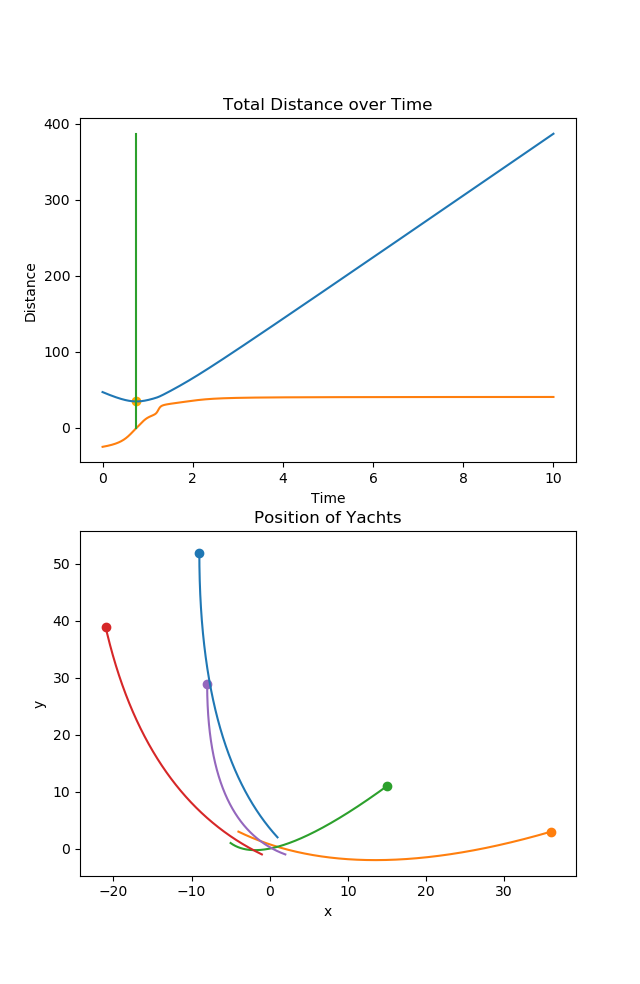

# Minimum Distance Calculator
This is a simple ~50 line script that is used to find the total distances between two
or more points in 2D Space.

Written by Syeam Bin Abdullah for a Mathematics Assignment.

